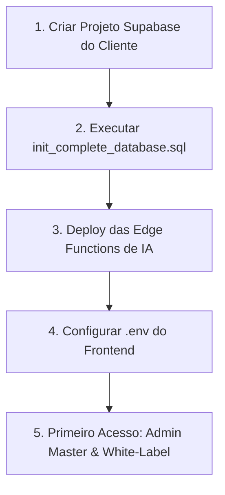

# 🚀 Guia de Implantação White-Label & Troca de Supabase

Este guia documenta o passo a passo para **implantar o CRM na conta Supabase do cliente final** ao vender o sistema, mantendo 100% da autonomia, segurança e identidade visual personalizada.

---

## 📋 Resumo do Fluxo de Instalação (5 Minutos)



---

## 🛠️ Passo 1: Criar o Projeto Supabase do Cliente
1. Acesse [supabase.com](https://supabase.com) e crie um novo projeto (ex: `crm-solar-cliente`).
2. Defina uma senha forte para o banco de dados PostgreSQL e selecione a região mais próxima (`sa-east-1` São Paulo).
3. Guarde os dados gerados em **Project Settings > API**:
   - **Project URL** (ex: `https://xyzcompany.supabase.co`)
   - **anon / public key** (ex: `eyJhbGciOi...`)
   - **service_role key** (ex: `eyJhbGciOi...`)

---

## 🗄️ Passo 2: Inicializar o Banco de Dados (1 Clique)

Existem duas formas simples de carregar todo o banco de dados:

### Opção A: Pelo Painel Web do Supabase (Mais Rápido — 1 Clique)
1. No painel do Supabase do cliente, vá em **SQL Editor > New Query**.
2. Abra o arquivo [`supabase/init_complete_database.sql`](file:///D:/Projetos/1.Autorais/WhiteLableCRM/supabase/init_complete_database.sql), copie todo o conteúdo e cole no SQL Editor.
3. Clique em **Run** (Executar).
4. *Pronto! Todas as tabelas, permissões RLS, buckets de arquivos e gatilhos de segurança foram criados.*

### Opção B: Via Supabase CLI (Para Desenvolvedor)
```bash
# Vincule ao projeto do cliente
supabase login
supabase link --project-ref <PROJECT_ID_DO_CLIENTE>

# Aplique as migrações
supabase db push
```

---

## ⚡ Passo 3: Deploy das Edge Functions de IA

Para ativar as funções de IA (Voz, Visão Computacional, Rotas e Clima):

```bash
# Na pasta raiz do projeto:
supabase functions deploy ai-voice-assistant --project-ref <PROJECT_ID_DO_CLIENTE>
supabase functions deploy ai-image-analysis --project-ref <PROJECT_ID_DO_CLIENTE>
supabase functions deploy ai-weather-alert --project-ref <PROJECT_ID_DO_CLIENTE>
supabase functions deploy ai-route-optimizer --project-ref <PROJECT_ID_DO_CLIENTE>
supabase functions deploy manage-users --project-ref <PROJECT_ID_DO_CLIENTE>
```

---

## 🌐 Passo 4: Configurar e Hospedar o Frontend

No ambiente de deploy do frontend (Vercel, Netlify, Cloudflare Pages ou VPS):

1. Configure as variáveis de ambiente:
```env
VITE_SUPABASE_URL="https://xyzcompany.supabase.co"
VITE_SUPABASE_PUBLISHABLE_KEY="eyJhbGciOi..."
```

2. Gere o build de produção:
```bash
npm run build
```

---

## 👑 Passo 5: Primeiro Acesso, Chaves de IA & White-Label

1. **Criar a Conta Administradora**:
   - Acesse a URL do CRM no navegador e clique em **Cadastrar**.
   - O **primeiro usuário cadastrado** no banco torna-se automaticamente **Admin Master** com privilégios totais.

2. **Personalizar a Marca (White-Label)**:
   - Acesse a aba **Configurações**:
     - Faça o upload da **Logo da Empresa** do cliente.
     - Escolha a **Cor Principal** da marca dele (o tema ajusta toda a interface dinamicamente).
     - Defina o **Nome da Empresa**.

3. **Configurar as Chaves de IA & Fallback**:
   - Na seção **Inteligência Artificial (IA) & Provedor LLM**:
     - Selecione o provedor (Google Gemini, OpenAI, OpenRouter ou Groq).
     - Cole a API Key.
     - Deixe ativado o **Modo de Resiliência & Fallback Automático**.
     - Clique em **Testar Conexão com IA** para validar.
     - Clique em **Salvar Configurações**.

---

## 🛡️ O que acontece se a IA do cliente ficar sem créditos?

O sistema possui **resiliência determinística nativa**:
- O **Otimizador de Rotas** agrupa equipes e bairros por heurística local.
- O **Alerta de Chuva** consome dados abertos do Open-Meteo.
- O **Assistente Técnico** responde procedimentos de emergência via base técnica local integrada.
- Os técnicos em campo e vendedores **nunca são bloqueados por indisponibilidade de IA**.
